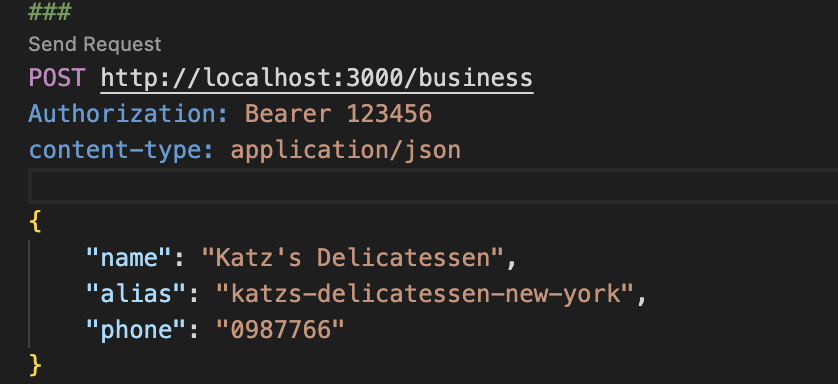

# CRUD REST API with Node.js, Express and PostgreSQL

## Running Locally
Tools that you will need to get started are:

- Node.js (I'm using version 18.7.0)
- PostgreSQL (I'm using version 14.6)
- IDE of choice (e.g. Visual Studio Code)

### Starting Development
Open your terminal (cmd, git bash and so on)

Clone this repository by:

```
git clone https://github.com/rismawtsa/62teknologi-senior-backend-test-rismawati-lasa.git
```

Change the directory:

```
cd 62teknologi-senior-backend-test-rismawati-lasa
```

Install the dependencies:

```
npm install
```

Create the `.env` file from the `.env.example` file, and change the value of the database config based on your local environment.
```
DB_HOST=localhost
DB_PORT=5432
DB_NAME=business
DB_USER=root
DB_PASSWORD=
DB_DRIVER=postgres
```

Create a database:
```
npm run db:create
```

Run database migrations:
```
npm run db:migrate
```

Run the server on development mode:
```
npm run dev
```

The output on the terminal looks very similar to this:


### Testing
Testing can be done using Visual Studio Code by using the [REST Client](https://marketplace.visualstudio.com/items?itemName=humao.rest-client) extensions. Open the `test.http` file:



Click `Send Request` link, the response will be previewed on the right side.


You can also use another app like postman.